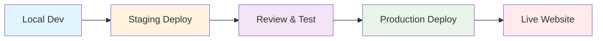

<div align="center">

# 🚀 Effuse Labs (Private Repository)

### *Intelligent Software for Small Business Growth*

[](./CHANGELOG.md)
[](./LICENSE)

[](https://nextjs.org/)
[](https://www.typescriptlang.org/)
[](https://tailwindcss.com/)
[](https://railway.app/)

[](https://nodejs.org/)
[](https://eslint.org/)
[](https://prettier.io/)
[](https://www.w3.org/WAI/WCAG2AA-Conformance)

[](https://effuse.io)
[](https://effuselabs-staging.up.railway.app)
[](./docs/)

---

**Sprint 4:** In progress • Hero CMS complete • Perf/mobile optimization remaining

</div>

## Contents

- Quick start
- Environment
- Commands
- Documentation
- Deployment

---

Effuse Labs is a modern technology company based in Winnipeg, Manitoba, dedicated to building intelligent, industry-specific software (Vertical SaaS) for underserved small and medium-sized businesses across North America. Our mission is to pour out a continuous stream of innovative ideas, elegant code, and intelligent solutions that democratize the power of data for local businesses.

## Quick start

```bash
npm install
npm run dev
# open http://localhost:3000
```


## Environment

Create `.env.local`:

```
NEXT_PUBLIC_SANITY_PROJECT_ID=...
NEXT_PUBLIC_SANITY_DATASET=production
NEXT_PUBLIC_SANITY_API_VERSION=2024-01-01
# Optional: SANITY_READ_TOKEN=... (private dataset)
```


## Commands

### Prerequisites

- Node.js 18.0.0 or higher
- npm or yarn package manager
- Docker (optional, for containerized development)

**Windows Users:** If you encounter PATH issues with npm/Node.js, use the provided helper scripts (see Installation step 6).

### Installation

1. **Clone the repository**

   ```bash
   git clone https://github.com/effuselabs/effuse-website.git
   cd effuse-website
   ```

2. **Install dependencies**

   ```bash
   npm install
   # or
   yarn install
   ```

3. **Set up environment variables**

   ```bash
   cp .env.example .env.local
   # Edit .env.local with your configuration
   ```

```bash
npm run dev      # start dev server
npm run build    # production build
npm run start    # run production server
npm run lint     # lint code
```

5. **Open your browser**
   Navigate to [http://localhost:3000](http://localhost:3000)

6. **Windows PATH Fix (if needed)**
   If you get "npm is not recognized" errors, use one of these helper scripts:
   ```bash
   # Option 1: Double-click this file in your project folder
   start-dev-simple.bat
   
   # Option 2: Run in PowerShell for guided setup
   .\setup-dev-environment.ps1
   ```

### ⚡ **Optimized Development Workflow**

**Recommended: Direct Next.js (Fastest)**
```bash
npm run dev     # Start with hot reload → http://localhost:3000
npm run build   # Test production build locally
npm run start   # Test production server locally
```

**Why Direct Next.js?**
- ⚡ Faster hot reload (200-500ms vs 2-5s)
- 🐛 Better debugging and IDE integration  
- 💾 Lower resource usage
- 🎯 Simpler daily workflow

### Docker Development (Production Testing Only)

```bash
# Only when testing exact production environment
docker build -t effuse-website .
docker run -p 3000:3000 effuse-website
```

## 💻 Development Workflow

### Project Structure

```
effuse-website/
├── app/                    # Next.js App Router
│   ├── layout.tsx         # Root layout
│   ├── page.tsx           # Homepage
│   └── globals.css        # Global styles
├── components/
│   ├── ui/                # Reusable UI elements
│   ├── layout/            # Layout components
│   └── sections/          # Page-specific sections
├── public/                # Static assets
├── lib/                   # Helper functions
├── docs/                  # Project documentation
├── start-dev-simple.bat   # Windows dev server helper
├── setup-dev-environment.ps1 # Windows environment setup
└── tailwind.config.ts     # Tailwind configuration
```

### Branch Strategy

- **Development**: Feature branches from `main`
- **Naming**: Follow Linear ticket format (e.g., `feat/LIN-1-setup-project`)
- **Commits**: Small, atomic commits with clear messages
- **Pull Requests**: Required for all changes to `main`

### Key Commands

```bash
# Development
npm run dev          # Start development server
npm run build        # Build for production
npm run start        # Start production server
npm run lint         # Run ESLint
npm run type-check   # TypeScript type checking

# Testing
npm run test         # Run tests
npm run test:watch   # Run tests in watch mode
npm run test:e2e     # Run end-to-end tests

# Windows Helper Scripts (if npm not recognized)
start-dev-simple.bat           # Double-click to start dev server
.\setup-dev-environment.ps1    # Interactive environment setup
```

### Project Status & Management

Track development progress and sprint status in our **[Development Status Dashboard](./docs/DEVELOPMENT_STATUS.md)**.

For Linear project management methodology, see our **[Linear Labeling Guide](./docs/LINEAR_LABELING_GUIDE.md)**.

## ♿ Accessibility Commitment

Accessibility is a core value at Effuse Labs. Our founder, Jeremy Shields, is a federally-recognized person with a disability, and we are committed to creating technology that works for everyone.

### Standards

- **WCAG AA Compliance**: All our applications meet Web Content Accessibility Guidelines 2.1 AA
- **Automated Testing**: ESLint plugin for accessibility (jsx-a11y) integrated into CI/CD
- **Manual Testing**: Regular testing with screen readers and assistive technologies
- **Inclusive Design**: Design decisions prioritize usability for all users

## 🤝 Contributing

We welcome contributions from the community! Please see our [Contributing Guidelines](./docs/CONTRIBUTING.md) for details.

### Quick Start for Contributors

1. Fork the repository
2. Create a feature branch: `git checkout -b feat/your-feature-name`
3. Make your changes following our coding standards
4. Run tests and linting: `npm run test && npm run lint`
5. Commit with clear messages
6. Push to your fork and submit a pull request

### Code Standards

- **TypeScript**: Strict mode enabled
- **ESLint**: Extended with accessibility rules
- **Prettier**: Code formatting
- **Accessibility**: All interactive elements must be keyboard accessible

## 📚 Documentation

### Project Management
- **[Development Status Dashboard](./docs/DEVELOPMENT_STATUS.md)**: Sprint progress and issue tracking
- **[Linear Labeling Guide](./docs/LINEAR_LABELING_GUIDE.md)**: Project management methodology and label system
- **[Development Plan](./docs/DEVELOPMENT_PLAN.md)**: Technical roadmap and sprint architecture

### Business & Brand
- **[Business Overview](./docs/BUSINESS_OVERVIEW.md)**: Company mission and product details  
- **[Brand Style Guide](./docs/BRAND_STYLEGUIDE.md)**: Visual identity and brand guidelines

### Development Setup
- **Project README** *(this file)*: Setup, workflow, and troubleshooting
- **[Deployment Guide](./docs/DEPLOYMENT_GUIDE.md)**: Three-environment pipeline setup
- **[CHANGELOG](./CHANGELOG.md)**: Complete project history and version tracking

## Deployment

- Development: http://localhost:3000
- Staging: https://effuselabs-staging.up.railway.app (v0.1.0)
- Production: https://effuse.io (v0.1.0)

### Environment Variables

Required environment variables are documented in `.env.example`. Production environment uses:
- `NEXT_PUBLIC_SITE_URL=https://effuse.io`
- `NODE_ENV=production`
- `NEXT_TELEMETRY_DISABLED=1`

Contact the development team for access to production credentials.

## 👥 Contributors

<div align="center">

### 🚀 Core Team

| Role | Developer | GitHub | Contributions |
|------|-----------|--------|---------------|
| **🎯 Project Lead** | Jeremy Shields | [@jshields-ca](https://github.com/jshields-ca) | Architecture, Strategy, Business |
| **🤖 AI Development** | AI Assistant | - | Implementation, Documentation, DevOps |

### 🌟 Want to Contribute?

We welcome contributions! See our [Contributing Guidelines](#-contributing) below.

[](./CHANGELOG.md)
[](#-contributing)
[](#-contributing)

</div>

---

## 📞 Contact & Support

<div align="center">

### 🏢 Company Information

**[Effuse Labs](https://effuse.io)** • Winnipeg, Manitoba, Canada 🇨🇦

[](https://effuse.io)
[](mailto:hello@effuse.io)
[](https://maps.app.goo.gl/winnipeg)

### 🛠️ Development & Support

[](https://github.com/effuselabs/effuse-website/issues)
[](https://github.com/effuselabs/effuse-website/discussions)
[](https://linear.app/scootr-ca/project/effuseio-7194bedc3fdf)

</div>

---

## 📄 License & Legal

<div align="center">

[](./LICENSE)

**Open Source** • **MIT Licensed** • **Commercial Use Allowed**

</div>

---

## 🌟 Show Your Support

<div align="center">

**Star this project if you find it helpful! ⭐**

[](https://github.com/effuselabs/effuse-website)

### 🚀 Follow Our Journey

[](https://effuse.io)
[](https://linear.app/scootr-ca/project/effuseio-7194bedc3fdf)
[](./CHANGELOG.md)

**Built with ❤️ in Winnipeg, Manitoba 🇨🇦**

*Empowering small businesses across North America with intelligent, accessible software*

---

<sup>© 2025 Effuse Labs • Intelligent Software for Small Business Growth</sup>

</div>

---

For detailed project updates and release history, see our [**CHANGELOG**](./CHANGELOG.md) and [**Development Status Dashboard**](./docs/DEVELOPMENT_STATUS.md).

### 🗺️ Version Roadmap

| Version | Sprint | Focus | Status | Target |
|---------|--------|-------|--------|--------|
| v0.1.0 | Sprint 1 | Foundation & Environment | ✅ **Complete** | August 2025 |
| v0.2.0 | Sprint 2 | UI Components & Animations | ✅ **Complete** | August 2025 |
| v0.3.0 | Sprint 3 | Navigation & Layout | ✅ **Complete** | August 2025 |
| v0.4.0 | Sprint 4 | Hero Section & 3D Graphics | 🔄 **In Progress** | August 2025 |
| v0.5.0 | Sprint 5 | Feature Sections & Content | ⏳ Planned | October 2025 |
| v0.6.0 | Sprint 6 | CMS Integration | ⏳ Planned | October 2025 |
| v0.7.0 | Sprint 7 | Accessibility & Testing | ⏳ Planned | November 2025 |
| v0.8.0 | Sprint 8 | Launch Preparation | ⏳ Planned | November 2025 |
| **v1.0.0** | **Launch** | **🎉 Production Release** | ⏳ **Planned** | **December 2025** |

---

## 📊 Project Stats & Metrics

<div align="center">

### 🏃‍♂️ Development Velocity

```
📈 Sprint Efficiency: 500% average (1 day vs 5+ day estimates)
🚀 Sprints Completed: 3.5/8 (Sprint 1, 2, 3, 4 in progress)
🎯 Code Quality: Zero warnings/errors maintained
🔄 Build Success Rate: 100% 
⚡ Hot Reload Speed: ~200-500ms
🌍 Deploy Environments: 3 (Dev/Staging/Production)
🎭 Animation Performance: 60fps GPU-accelerated animations
```

### 🛠️ Technical Metrics

| Metric | Target | Current | Status |
|--------|--------|---------|--------|
| **Bundle Size** | <250KB | Optimized | ✅ |
| **Load Time** | <2s | <1s | ✅ |
| **Lighthouse Score** | 90+ | TBD | ⏳ |
| **WCAG Compliance** | AA | Configured | ✅ |
| **TypeScript Coverage** | 100% | 100% | ✅ |

### 🔗 Live Links

[](https://effuse.io)
[](https://effuselabs-staging.up.railway.app)

</div>

---

## 🎯 Demo & Screenshots

<div align="center">

### 🌐 Live Website Preview

> **[Visit Live Site →](https://effuse.io)**

*Currently featuring sophisticated Hatching Core animations with organic fluid motion and dramatic icon reveals*

</div>

<details>
<summary><strong>🖼️ Development Screenshots (Click to expand)</strong></summary>

```
🎭 Sophisticated Hatching Core animations with organic fluid motion
📸 Features: Multi-layered background flow, dramatic icon reveals, synchronized text animations
🎨 Advanced animation system with 60fps GPU-accelerated performance
✨ Breathing button animations and enhanced particle systems
```

</details>

---

## 🚀 Quick Start

### One-Line Development Setup

```bash
# Clone, install, and start developing
git clone [repository] && cd effuse-website && npm install && npm run dev
```

### 🪟 Windows Users Quick Start

```bash
# Just double-click this file in your project folder!
start-dev-simple.bat
```

### 🐳 Docker Alternative (Optional)

```bash
# For production environment testing
docker build -t effuse-website . && docker run -p 3000:3000 effuse-website
```

---

## 🤖 Development Workflow

### 🔄 Standard Development Cycle


```mermaid
graph LR
    A[Local Dev] --> B[Staging Deploy]
    B --> C[Review & Test]
    C --> D[Production Deploy]
    D --> E[Live Website]
    
    style A fill:#e1f5fe
    style B fill:#fff3e0
    style C fill:#f3e5f5
    style D fill:#e8f5e8
    style E fill:#ffebee
```

### 📋 Deployment Commands

```bash
# 🔨 Development
npm run dev              # Start local development server

# 🧪 Staging
railway environment staging && railway up

# 🚀 Production  
railway environment production && railway up
```

---

## 🔧 Troubleshooting

### Windows Development Environment Issues

#### npm/Node.js Not Recognized
If you see `"npm is not recognized as a cmdlet"` errors:

**Quick Fix:**
1. Double-click `start-dev-simple.bat` in your project folder
2. Or run `.\setup-dev-environment.ps1` in PowerShell

**Manual Fix:**
```powershell
$env:PATH = "C:\Users\[YourUsername]\AppData\Roaming\npm;C:\Program Files\nodejs;" + $env:PATH
npm run dev
```

#### Development Server Not Accessible
If `http://localhost:3000` shows connection errors:

1. **Check if server is running:**
   ```bash
   netstat -an | findstr :3000
   ```

2. **Try alternative URLs:**
   - `http://127.0.0.1:3000`
   - Check Windows Firewall permissions

3. **Restart development server:**
   ```bash
   # Kill any existing processes
   taskkill /F /IM node.exe
   # Start fresh
   npm run dev
   ```

#### Browser Issues
- Try different browser (Chrome, Edge, Firefox)
- Clear browser cache
- Try incognito/private mode

#### Build Issues

**Tailwind CSS Build Errors:**
If you encounter "Cannot find module 'tailwindcss'" errors:
```bash
# Ensure Tailwind is in production dependencies
npm install tailwindcss@^3.4.17 postcss autoprefixer --save

# Verify installation
npm list tailwindcss
# Should show: tailwindcss@3.4.17

# Test build
npm run build
```

**PostCSS Plugin Errors:**
If you see "PostCSS plugin has moved" errors, ensure you're using Tailwind CSS v3.4.x, not v4+:
```bash
npm uninstall tailwindcss
npm install tailwindcss@^3.4.17 --save
```

### Helper Scripts Available

| Script | Purpose | Usage |
|--------|---------|-------|
| `start-dev-simple.bat` | Quick start development server | Double-click to run |
| `setup-dev-environment.ps1` | Interactive environment setup | Run in PowerShell |

---

**© 2025 Effuse Labs. Intelligent Software for Small Business Growth.**

---
